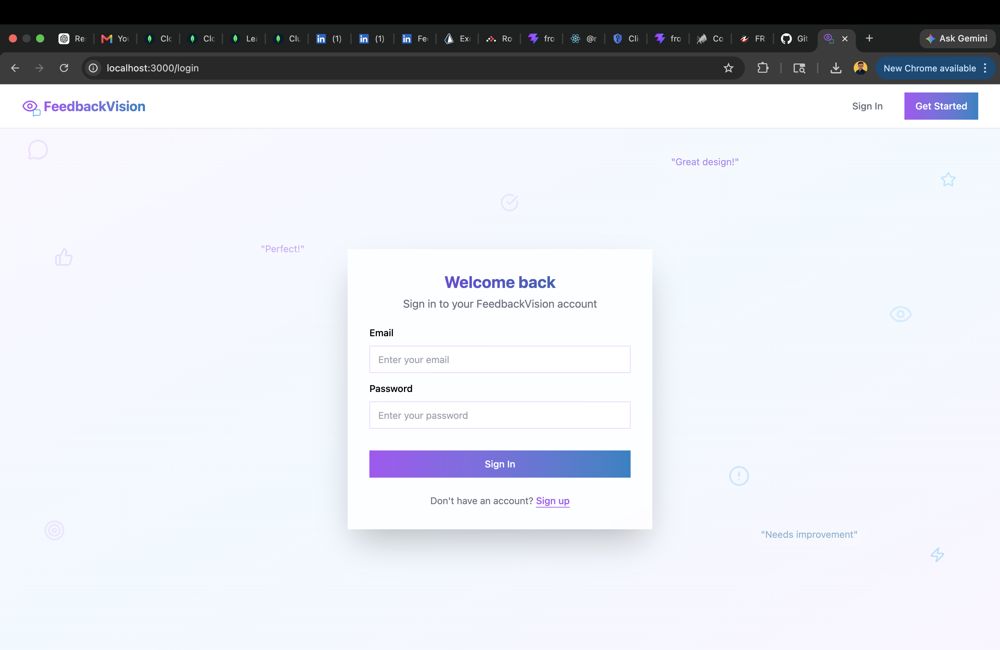
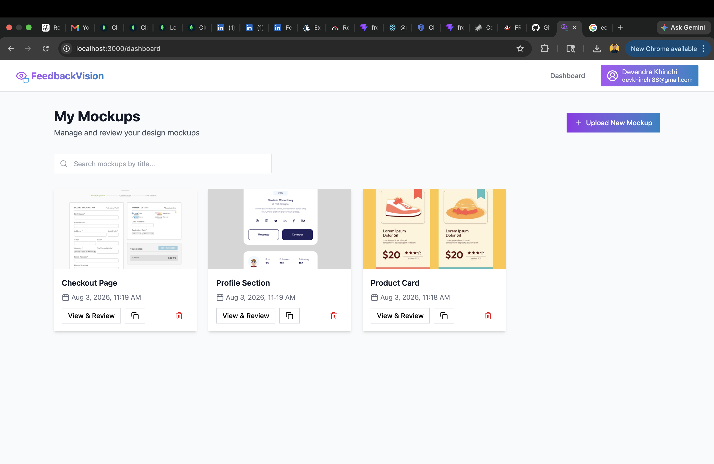
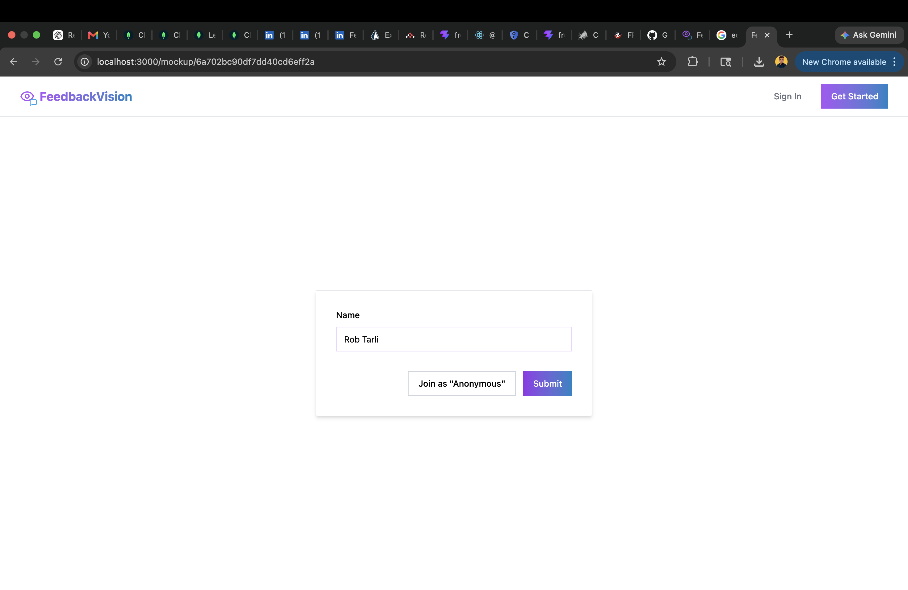
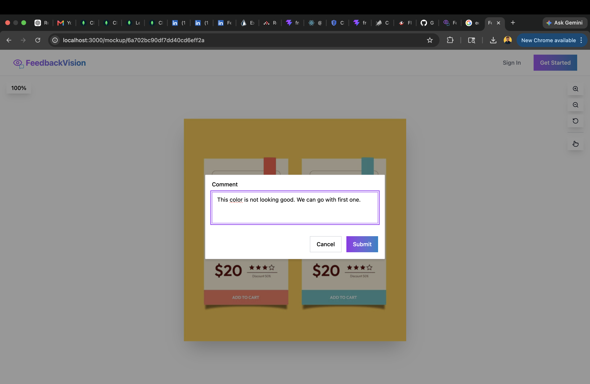
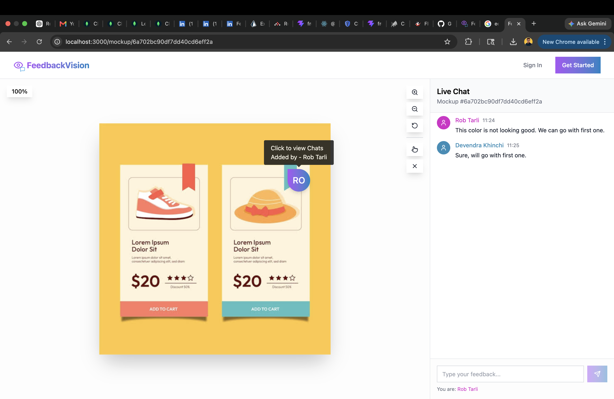
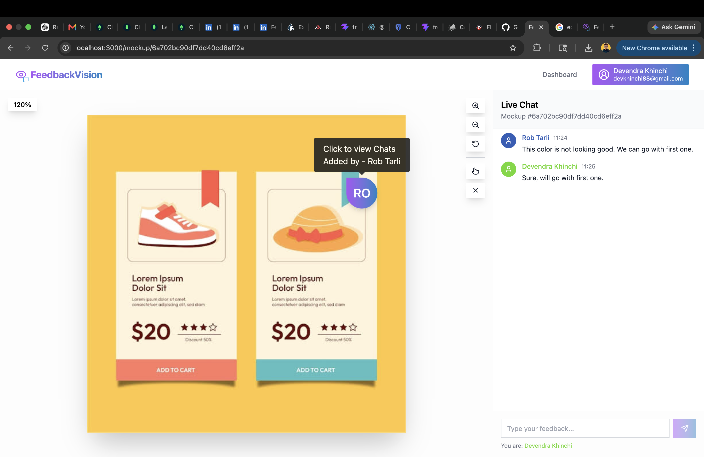

# Collaborative Design Tool 🖌️

A full-stack real-time collaborative design feedback platform built with **React, Node.js, Express, MongoDB, Socket.IO, and Docker**.

The application enables teams to upload design mockups, place coordinate-based annotations, and collaborate in real time through WebSockets. All feedback is persisted in MongoDB, while JWT authentication secures user access.

---

## 📸 Screenshots

### Login



### Dashboard



### Reviewer Open link share by designer





### Reviewer Screen



### Designer Screen



---

## ✨ Features

- Secure user authentication using JWT
- Upload and manage design mockups
- Coordinate-based feedback annotations
- Real-time collaboration using Socket.IO rooms
- Threaded discussions for each feedback point
- Persistent data storage using MongoDB
- Responsive React interface
- Dockerized development environment

---

## 🏗️ Architecture

```
React (Vite)
        │
 REST API + Socket.IO
        │
 Node.js + Express
        │
 Controllers
        │
 Services
        │
 Mongoose Models
        │
 MongoDB
```

The backend follows a layered architecture:

```
Routes
   ↓
Controllers
   ↓
Services
   ↓
Models (MongoDB)
```

This separation keeps routing, business logic, and database operations independent and easier to maintain.

---

## 📦 Tech Stack

### Frontend

- React
- Vite
- Tailwind CSS

### Backend

- Node.js
- Express.js
- Socket.IO
- Express Validator

### Database

- MongoDB
- Mongoose

### Authentication

- JWT
- bcryptjs

### File Uploads

- Multer

### DevOps

- Docker
- Docker Compose

---

## 📂 Project Structure

```
client/
    src/
        components/
        pages/
        context/

server/
    controllers/
    middleware/
    models/
    routes/
    services/
    utils/
```

---

## ⚡ Real-time Collaboration

When a user opens a mockup:

1. The client joins a Socket.IO room associated with that mockup.
2. Creating a feedback point stores it in MongoDB.
3. The backend broadcasts the update to everyone viewing the same mockup.
4. Connected clients update instantly without refreshing the page.

This approach eliminates polling and enables real-time collaboration.

---

## 🔐 Authentication

Authentication is implemented using JSON Web Tokens (JWT).

- User signup/login
- Password hashing using bcrypt
- Protected API routes
- Authenticated access to user-owned resources

---

## 📤 File Uploads

Image uploads are handled using **Multer**.

During local development, uploaded files are stored in the server's local uploads directory and served as static assets.

---

## 🚀 Quick Start

### Prerequisites

- Node.js
- npm
- Docker & Docker Compose

---

### Clone Repository

```bash
git clone https://github.com/devendra-khinchi/Collaborative-Design-Tool.git

cd Collaborative-Design-Tool
```

---

### Local Development

Install dependencies

```bash
cd server
npm install

cd ../client
npm install
```

Create `.env` inside `server/`

```env
MONGODB_URI=your_mongodb_uri
PORT=8000
JWT_TOKEN_SECRET=your_secret
JWT_TOKEN_EXPIRY=1d
CORS_ORIGIN=http://localhost:5173
```

Run backend

```bash
cd server
npm run dev
```

Run frontend

```bash
cd client
npm run dev
```

Frontend

```
http://localhost:5173
```

Backend

```
http://localhost:8000
```

---

## 🐳 Docker

The complete application can be started using Docker Compose.

```bash
docker compose up --build
```

This provisions:

- React Frontend
- Express Backend
- MongoDB
- Persistent MongoDB volume

Application URLs

Frontend

```
http://localhost:3000
```

Backend

```
http://localhost:8000
```

MongoDB

```
localhost:27017
```

---

## 📡 API Overview

```
POST   /api/v1/auth/signup
POST   /api/v1/auth/login

GET    /api/v1/mockups
POST   /api/v1/mockups
DELETE /api/v1/mockups/:id
```

---

## 📚 Key Learnings

This project helped me gain practical experience with:

- Designing REST APIs using Express.js
- Layered backend architecture (Controller → Service → Model)
- JWT authentication
- MongoDB schema design
- Real-time communication using Socket.IO
- File uploads using Multer
- Dockerizing a multi-container application

---

## 🚀 Future Improvements

- JWT-authenticated Socket.IO connections
- Cloud Storage integration
- Structured logging with Pino
- Request validation using Zod
- Online user presence
- Redis Pub/Sub for horizontal Socket.IO scaling

---

## 👨‍💻 Author

**Devendra Khinchi**

If you found this project useful, feel free to star the repository.
